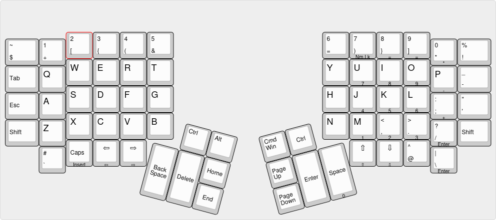
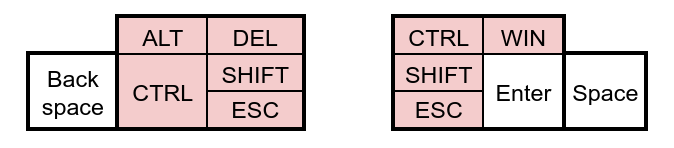

# Harry's Programmer Qwerty

Taking inspiration from ThePrimeagen, who created Real Programmer's Dvorak, and understanding both the reasoning behind his modification of the symbols for better access in programming, and also not wanting or needing to learn dvorak at this point in time, meant that an adaptation of this symbol layout into my qwerty setup on the Kinesis Advantage 360 Pro was in order.

I copied the top row layout from ThePrimeagen, and was left with 5 keys that were now homeless (@, #, ^, -, \_). However the 5 keys that had replaced them ([,{,},],~) were now in duplicate, so it was a simple matter of deciding what to put where.

## Current layout

So this is what I went with, however afterwards I realised that this has probably been done before, and a quick google showed me that I was right. Renerocksai had created a very similarly inspired layout ([Github link](https://github.com/renerocksai/real-prog-qwerty)). He hadn't gone as far as to copy the entire top row, however he had adjusted the thumb cluster in a way that was appealling to me.

While I don't see the need to swap ctrl and win, the draw of replacing home, end, pg up, and pg dn with actually useful keys is strong. Also moving the ctrl key to the delete key as it is more frequently used, and ideally a stronger command over vim motions should reduce the amount I use the delete key. Currently I often would mouse click into the middle of a work and then use both backspace and delete in order to remove it. These keys however I can directly reprogram on the kinesis clique gui, as opposed to the actual creation of a new layout that I outline below.

## Implementation

The actual implementation wasn't too hard, it was a simple matter of creating a symbols file which I used the nz symbols as a base, but instead of adding macrons to the keyboard, I added my mappings. This [file](hb) needs to be saved in `/usr/share/X11/xkb/symbols`, and then the [metadata](layout-rules.txt) needs to be added to the `<layoutList>` in `/usr/share/X11/xkb/rules/base.xml`. It was suggested that I put this in evdev.xml instead but I had seem a github issue that suggested that Cosmic (the DE on Pop_OS) pulls metadata from base instead. Anyway it all seems to work, but in my bash script I might add to both, as it seems a little buggy at the moment where the keyboard is appearing in the settings selector, but not in the toolbar selector. So I shall try adding it to both to see what happens, plus this should future proof my install script if I run it on a different OS.

https://codeaffen.org/2023/09/16/custom-keyboard-layouts-with-xkb/
